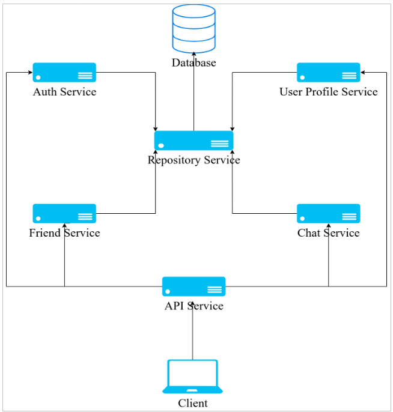
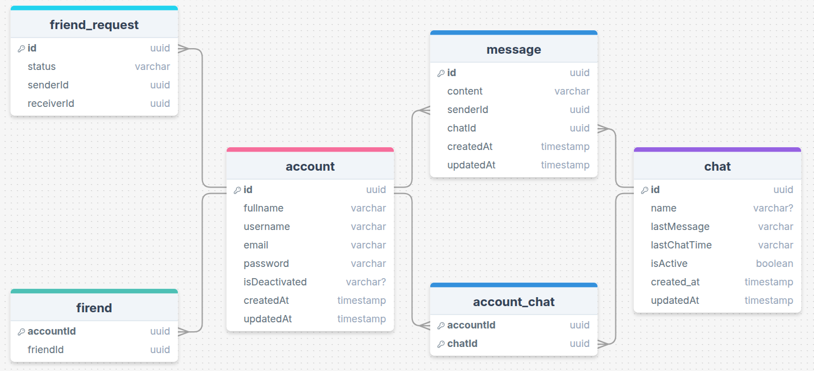
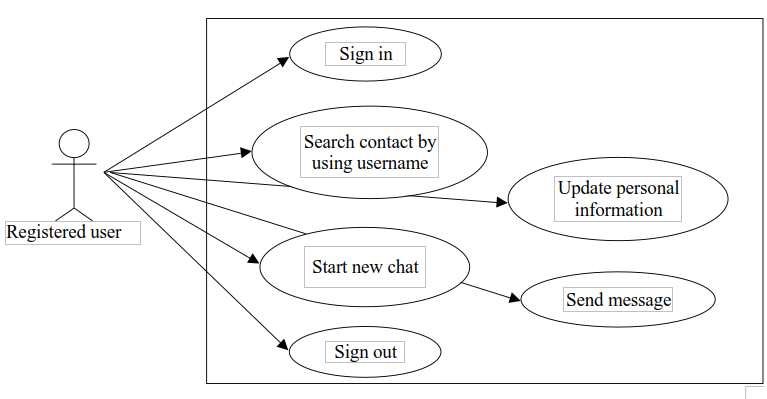
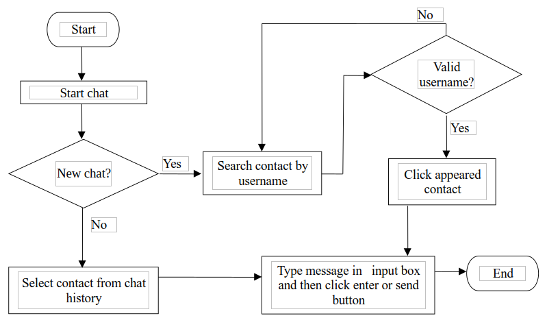
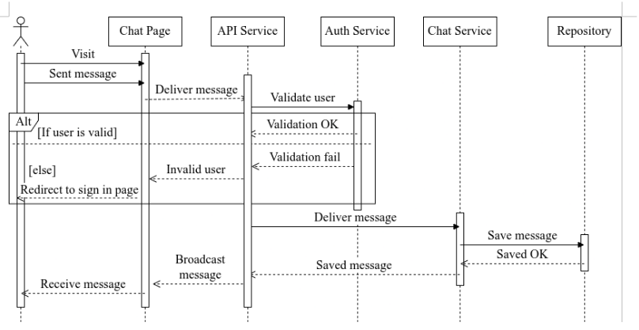

# it-chat

Real-Time Chat Application

## Overview
`it-chat` is a real-time chat application built with a modern tech stack. It enables users to send and receive messages instantly while ensuring security and scalability.

## System Architecture

### **System Overview Diagram**
Below is the high-level system architecture illustrating the key components and their interactions.



### **ER Diagram**
This diagram details how the tables are related to each other. .



### **Usecase Diagram**
This diagram outlines the system's use cases and their interactions.



### **Flow Chart**
This diagram illustrates the flow of data through the system.




### **Sequence Diagram**
This diagram illustrates the sequence of events and interactions within the system.



## Pre-Requirements

Ensure the following dependencies are installed before running the application:
- **NodeJS**
- **NPM**
- **PostgreSQL**

## Initializing the Project

Navigate to the project directory and install dependencies for both frontend and backend.

### **Frontend Setup**
```sh
cd ./frontend
npm install
```

Create a `.env` file in the frontend directory and set the following environment variable:

```
URL=<your_frontend_url>
```

### **Backend Setup**
```sh
cd ./backend
npm install
```

Create a `.env.development` file in the backend directory and configure the following environment variables:

```
JWT_ACCESS_TOKEN=<your_jwt_token>
POSTGRES_USER=<your_postgres_user>
POSTGRES_HOST=<your_postgres_host>
POSTGRES_PASSWORD=<your_postgres_password>
POSTGRES_DATABASE=<your_postgres_database>
```

## Running the Application

Start the application using the following command:

```sh
npm start
```

## Contributing

Contributions are welcome! Please submit issues and pull requests to improve the system.

## License

This project is licensed under the MIT License. See the `LICENSE` file for details.

